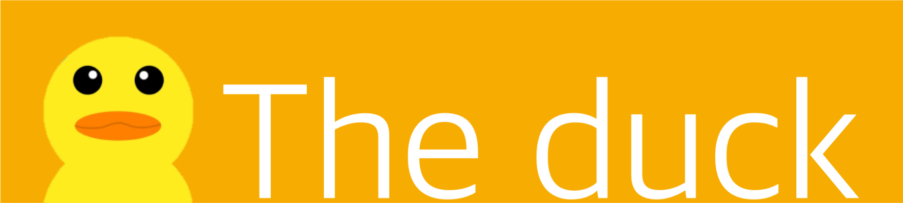
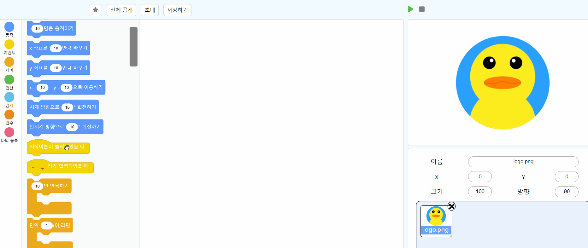
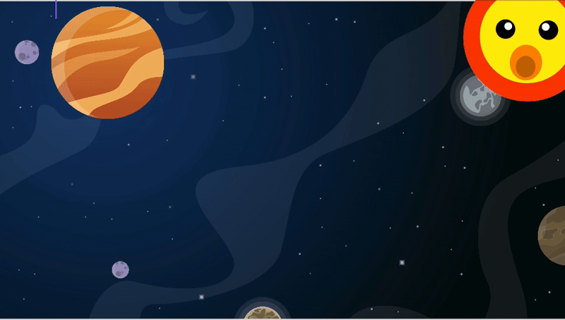

<p>
  
  
  
  <br>
  
  
  
    
      
      <br>
    <a href="https://www.apache.org/licenses/LICENSE-2.0" target="_blank">
    
  </a>
  
</p>

## 나를 소개하지!
안녕! 나는 블록코딩 하는 오리 더덕이야👋<br>
나는 너희들에게 **프로그래밍**이 재밌다는걸 알려주고 싶어<br><br>

<br><br>이렇게 블록을 붙여서  실행시키면! &nbsp;**별똥더덕**도 만들 수 있다구 🔭
<br><br>

<br><br>

### 얼른 더덕이랑 블록코딩하자구!
### 주소는 http://theduck.cf 야!!
## Getting started
### 1. Front-end
  1. Move to `front` directory
```shell
  cd front
```
2. Install all packages
```shell
  yarn
```
3. Build scripts
```shell
  yarn build
```
4. Run scripts
```shell
   yarn production  # you must install serve (yarn global add serve)
```
### 2. Back-end
1. Move to `back` directory
```shell
  cd back
```

1. Install all packages
```shell
  yarn
```
2. generate prisma model
```shell
  prisma generate # you must have prisma.yml
```

2.  Run scripts
```shell
  yarn start 
```

## Team 

<!-- ALL-CONTRIBUTORS-LIST:START - Do not remove or modify this section -->
<!-- prettier-ignore -->
<table>
  <tr>
    <td align="center"><a href="https://github.com/munsulim/"><br /><sub><b>Munsu Lim</b></sub></a><br /><a href="https://github.com/connect-foundation/2019-13/commits/dev?author=munsulim" title="Code">💻</a> </td>
    <td align="center"><a href="https://github.com/kkw01234"><br /><sub><b>Keonwook Kim</b></sub></a><br /><a href="https://github.com/connect-foundation/2019-13/commits/dev?author=kkw01234" title="Code">💻</a></td>
    <td align="center"><a href="https://github.com/NBJ1995"><br /><sub><b>Jinkwan Yoo</b></sub></a><br /><a href="https://github.com/connect-foundation/2019-13/commits/dev?author=NBJ1995" title="Code">💻</a></td>
  </tr>
  </table>
## docs

[Wiki](https://github.com/connect-foundation/2019-13/wiki)
[Notion](https://www.notion.so/kkw01234/13-The-Duck-a15213f7766f406ca9f43d59f381edb8)

## 📝 License

Copyright © 2019 [부스트캠프 13조](https://github.com/connect-foundation/2019-13).<br />
This project is [Apache Lisence 2.0](https://www.apache.org/licenses/LICENSE-2.0) licensed.

